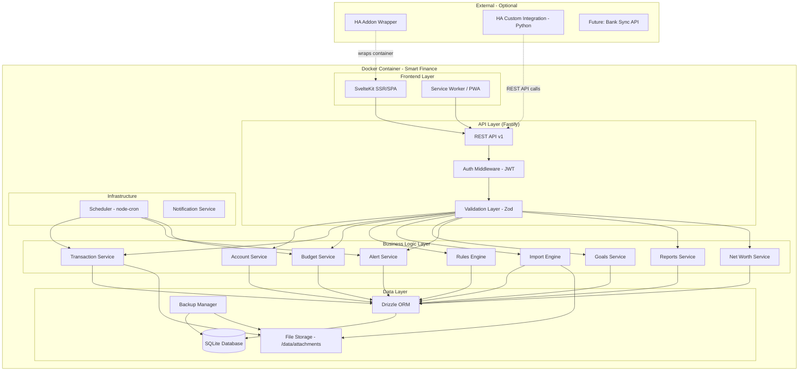
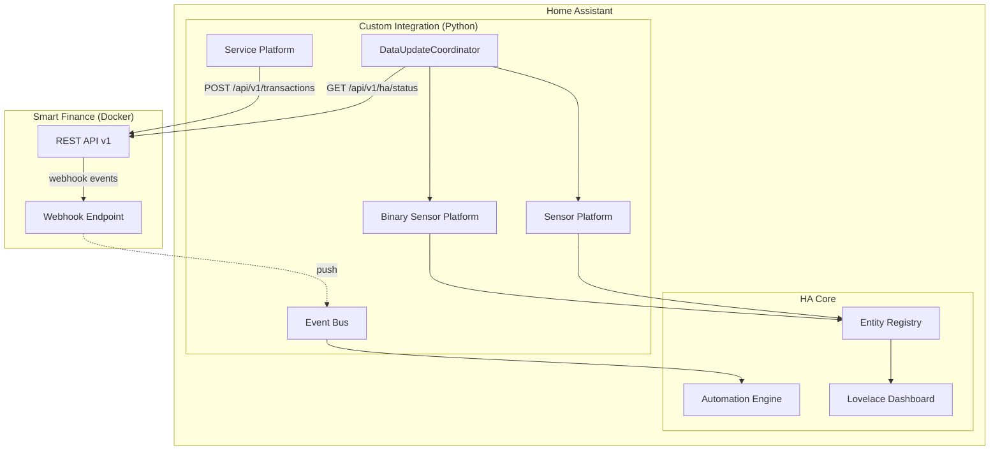
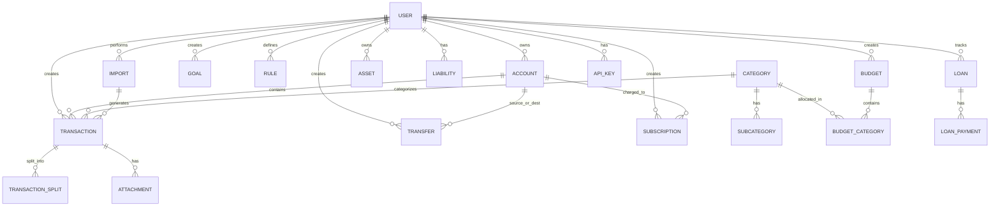

# Design Document: Smart Finance

## Overview

Smart Finance es una aplicación web auto-hospedada de gestión de finanzas personales de grado profesional. Está diseñada como un producto modular, open-source y gratuito que funciona de forma **completamente independiente** — sin requerir Home Assistant ni ningún otro sistema externo. Opcionalmente, puede integrarse como addon y custom integration de Home Assistant para usuarios de domótica.

La aplicación reemplaza un sistema existente en Notion y ofrece: gestión multi-cuenta, transacciones (incluyendo splits y reembolsos), presupuestos, suscripciones, metas de ahorro, importación bancaria (CSV/Excel/OFX), motor de reglas para auto-categorización, tracking de patrimonio neto (activos y pasivos), préstamos, adjuntos/recibos, dashboards completos y una API REST completa.

### Filosofía del Producto

- **Self-hosted first**: El usuario es dueño de sus datos. Sin telemetría, sin cloud obligatorio.
- **Works without Home Assistant**: La app es 100% funcional standalone. HA es un bonus.
- **Open source, sin paywalls**: Funcionalidad completa gratis. Monetización via donaciones y servicios opcionales futuros.
- **Privacy-focused**: Datos locales, sin tracking, sin venta de datos.
- **Mobile-optimized**: UI responsive mobile-first para entrada rápida de datos.
- **Developer-friendly**: API REST completa desde el día 1.

### Decisiones de Diseño Clave

| Decisión | Elección | Justificación |
|----------|----------|---------------|
| Frontend | SvelteKit (SSR + SPA) | Compilado, bundle mínimo (~40% menor que Next.js), excelente rendimiento en dispositivos low-end, menor consumo RAM en Docker |
| Backend API | Fastify (separado del frontend) | Ligero (~15MB RAM), 2-5x más rápido que Express, esquema JSON nativo, plugins maduros |
| Base de datos | SQLite (better-sqlite3) | Sin servidor separado, ACID compliant, archivo único respaldable, ideal para self-hosted multi-user pequeño |
| ORM | Drizzle ORM | Type-safe, ligero, soporte SQLite excelente, migraciones automáticas |
| Lenguaje | TypeScript (full-stack) | Type-safety end-to-end, shared types, mejor mantenibilidad |
| Autenticación | JWT + bcrypt (local) | Sin dependencia externa, simple, seguro para self-hosted |
| Empaquetado | Docker multi-arch + Docker Compose | Portable, HA-compatible, instalación en un comando |
| PWA | Service Worker + Workbox | Acceso offline desde móvil, instalable |
| Motor de Reglas | Engine basado en condiciones JSON | Extensible, persistible en DB, evaluable sin deps externas |
| Import Engine | Parser modular por banco | Arquitectura de plugins para CSV/OFX con mapeos por institución |
| HA Integration | Python custom_component + REST API | Sensores, servicios y eventos via polling al API de Smart Finance |
| Scheduler | node-cron | Cargos automáticos, evaluación de alertas, cálculo de presupuestos |
| Validación | Zod | Schemas compartidos frontend/backend, runtime validation |
| Moneda default | MXN (Peso Mexicano) | Mercado objetivo México, con soporte futuro multi-moneda |
| Idioma UI | Español | Interfaz completamente en español |

### Evaluación de Tech Stack: SvelteKit vs Next.js

Se evaluó Next.js + React como alternativa. La decisión favorece SvelteKit por estas razones:

| Criterio | SvelteKit | Next.js |
|----------|-----------|---------|
| Tamaño Docker image | ~80-120MB | ~200-350MB |
| RAM en runtime | ~40-60MB | ~100-200MB |
| Bundle size (client) | ~40% menor | Mayor (React runtime) |
| Compilación | Compile-time (sin Virtual DOM) | Runtime (Virtual DOM) |
| Developer Experience | Menos boilerplate, reactivity nativa | Más boilerplate, hooks |
| Ecosistema | Más pequeño pero suficiente | Enorme |
| Curva de aprendizaje | Más fácil | Media |
| SSR performance | Excelente | Excelente |
| Portabilidad Docker | Node adapter simple | standalone output funciona |

**Veredicto**: SvelteKit gana en los criterios prioritarios (bajo recurso, Docker ligero, rendimiento, simplicidad). El ecosistema menor de Svelte no es problema porque la app es self-contained y no necesita librerías de terceros complejas en el frontend.


## Architecture

### Patrón Arquitectónico: Monolito Modular con Capas Desacopladas

La arquitectura sigue un diseño modular donde cada capa es independiente y reemplazable. El core funciona sin HA, y la integración HA es un módulo externo que consume el API.



### Capas de la Arquitectura

1. **Frontend Layer**: SvelteKit app con SSR. PWA para acceso offline.
2. **API Layer**: REST API (Fastify) con autenticación JWT, rate limiting y validación Zod.
3. **Business Logic Layer**: Servicios independientes con lógica de negocio pura.
4. **Data Layer**: Drizzle ORM + SQLite + File storage para adjuntos.
5. **Infrastructure**: Scheduler (cron), notificaciones, health checks.
6. **Integration Layer** (externo): HA addon, HA custom integration, future bank APIs.

### Despliegue: Modos de Instalación

```mermaid
graph LR
    subgraph "Modo 1: Docker Compose (Recomendado)"
        DC[docker-compose.yml]
        DC --> CONTAINER1[smart-finance:latest]
        CONTAINER1 --> VOL1[Volume: /data]
    end
    
    subgraph "Modo 2: Docker Standalone"
        DS[docker run]
        DS --> CONTAINER2[smart-finance:latest]
        CONTAINER2 --> VOL2[Bind mount: ./data]
    end
    
    subgraph "Modo 3: HA Add-on"
        HASUP[HA Supervisor]
        HASUP --> CONTAINER3[Smart Finance Addon]
        CONTAINER3 --> VOL3[/config/addons_data/smart-finance]
    end
    
    subgraph "Modo 4: HA Custom Integration"
        HACS[HACS / manual]
        HACS --> PYCOMP[custom_components/smart_finance/]
        PYCOMP -->|polls| API[Smart Finance API]
    end
```

### Home Assistant Integration Architecture



### Estructura del Proyecto

```
smart-finance/
├── docker-compose.yml              # Instalación principal
├── Dockerfile                      # Multi-stage, multi-arch
├── .env.example                    # Variables de configuración
├── README.md                       # Documentación principal
│
├── packages/
│   ├── backend/                    # Fastify API server
│   │   ├── src/
│   │   │   ├── server.ts           # Entry point
│   │   │   ├── config.ts           # Environment config
│   │   │   ├── routes/             # API route handlers
│   │   │   │   ├── v1/
│   │   │   │   │   ├── auth.routes.ts
│   │   │   │   │   ├── accounts.routes.ts
│   │   │   │   │   ├── transactions.routes.ts
│   │   │   │   │   ├── transfers.routes.ts
│   │   │   │   │   ├── budgets.routes.ts
│   │   │   │   │   ├── subscriptions.routes.ts
│   │   │   │   │   ├── goals.routes.ts
│   │   │   │   │   ├── categories.routes.ts
│   │   │   │   │   ├── rules.routes.ts
│   │   │   │   │   ├── imports.routes.ts
│   │   │   │   │   ├── reports.routes.ts
│   │   │   │   │   ├── networth.routes.ts
│   │   │   │   │   ├── attachments.routes.ts
│   │   │   │   │   ├── users.routes.ts
│   │   │   │   │   ├── backup.routes.ts
│   │   │   │   │   └── ha.routes.ts        # HA-specific endpoints
│   │   │   │   └── index.ts
│   │   │   ├── services/           # Business logic
│   │   │   │   ├── account.service.ts
│   │   │   │   ├── transaction.service.ts
│   │   │   │   ├── transfer.service.ts
│   │   │   │   ├── budget.service.ts
│   │   │   │   ├── subscription.service.ts
│   │   │   │   ├── goal.service.ts
│   │   │   │   ├── category.service.ts
│   │   │   │   ├── rules-engine.service.ts
│   │   │   │   ├── import.service.ts
│   │   │   │   ├── report.service.ts
│   │   │   │   ├── networth.service.ts
│   │   │   │   ├── alert.service.ts
│   │   │   │   ├── auth.service.ts
│   │   │   │   ├── user.service.ts
│   │   │   │   └── backup.service.ts
│   │   │   ├── importers/          # Bank-specific parsers
│   │   │   │   ├── base-importer.ts
│   │   │   │   ├── csv-importer.ts
│   │   │   │   ├── ofx-importer.ts
│   │   │   │   ├── excel-importer.ts
│   │   │   │   └── banks/
│   │   │   │       ├── bbva.parser.ts
│   │   │   │       ├── santander.parser.ts
│   │   │   │       ├── nu.parser.ts
│   │   │   │       └── generic.parser.ts
│   │   │   ├── db/
│   │   │   │   ├── schema.ts       # Drizzle schema (all tables)
│   │   │   │   ├── migrations/     # SQL migration files
│   │   │   │   ├── seed.ts         # Default categories, admin user
│   │   │   │   └── connection.ts   # DB connection singleton
│   │   │   ├── middleware/
│   │   │   │   ├── auth.middleware.ts
│   │   │   │   ├── rate-limit.middleware.ts
│   │   │   │   └── error-handler.ts
│   │   │   ├── scheduler/
│   │   │   │   ├── index.ts
│   │   │   │   ├── auto-charge.job.ts
│   │   │   │   ├── alert-evaluation.job.ts
│   │   │   │   └── budget-reset.job.ts
│   │   │   ├── validators/         # Zod schemas
│   │   │   │   └── *.schema.ts
│   │   │   └── utils/
│   │   │       ├── currency.ts
│   │   │       ├── dates.ts
│   │   │       └── crypto.ts
│   │   ├── package.json
│   │   └── tsconfig.json
│   │
│   ├── frontend/                   # SvelteKit app
│   │   ├── src/
│   │   │   ├── routes/             # Pages
│   │   │   ├── lib/
│   │   │   │   ├── components/     # Reusable UI components
│   │   │   │   ├── stores/         # Svelte stores
│   │   │   │   ├── api/            # API client
│   │   │   │   └── utils/
│   │   │   ├── service-worker.ts
│   │   │   └── app.html
│   │   ├── static/
│   │   │   └── manifest.json
│   │   ├── svelte.config.js
│   │   └── package.json
│   │
│   └── shared/                     # Shared TypeScript types
│       ├── types/
│       │   ├── accounts.ts
│       │   ├── transactions.ts
│       │   ├── budgets.ts
│       │   └── ...
│       └── package.json
│
├── ha-addon/                       # Home Assistant Add-on
│   ├── config.yaml
│   ├── Dockerfile                  # Extends main image
│   ├── run.sh
│   ├── DOCS.md
│   └── translations/
│       └── es.yaml
│
├── ha-integration/                 # HA Custom Integration (Python)
│   ├── custom_components/
│   │   └── smart_finance/
│   │       ├── __init__.py
│   │       ├── manifest.json
│   │       ├── config_flow.py
│   │       ├── coordinator.py
│   │       ├── sensor.py
│   │       ├── binary_sensor.py
│   │       ├── services.py
│   │       ├── const.py
│   │       └── strings.json
│   └── hacs.json
│
└── docs/                           # Documentación adicional
    ├── api.md
    ├── installation.md
    ├── ha-integration.md
    └── development.md
```


## Components and Interfaces

### REST API v1 — Endpoints Completos

```typescript
// ============================================
// AUTENTICACIÓN Y USUARIOS
// ============================================

// POST /api/v1/auth/register      - Crear usuario (primer usuario = admin)
// POST /api/v1/auth/login         - Login (retorna JWT access + refresh token)
// POST /api/v1/auth/refresh       - Refresh token
// POST /api/v1/auth/logout        - Logout (invalidar refresh token)
// GET  /api/v1/auth/me            - Perfil del usuario actual

// GET  /api/v1/users              - Listar usuarios (admin only)
// POST /api/v1/users              - Crear usuario (admin only)
// PUT  /api/v1/users/:id          - Editar usuario
// DELETE /api/v1/users/:id        - Eliminar usuario (admin only)
// POST /api/v1/users/:id/api-keys - Generar API key
// DELETE /api/v1/users/:id/api-keys/:keyId - Revocar API key

// ============================================
// CUENTAS
// ============================================

// GET    /api/v1/accounts              - Listar cuentas del usuario
// GET    /api/v1/accounts/:id          - Detalle de cuenta con balance calculado
// POST   /api/v1/accounts              - Crear cuenta
// PUT    /api/v1/accounts/:id          - Editar cuenta
// PATCH  /api/v1/accounts/:id/deactivate - Desactivar cuenta
// GET    /api/v1/accounts/:id/balance-history - Historial de balance

// ============================================
// TRANSACCIONES
// ============================================

// GET    /api/v1/transactions          - Listar con filtros y paginación
// GET    /api/v1/transactions/:id      - Detalle (incluye splits)
// POST   /api/v1/transactions          - Crear transacción
// PUT    /api/v1/transactions/:id      - Editar transacción
// DELETE /api/v1/transactions/:id      - Eliminar transacción
// POST   /api/v1/transactions/quick    - Registro rápido
// POST   /api/v1/transactions/:id/split - Dividir transacción en splits
// POST   /api/v1/transactions/:id/reimburse - Marcar reembolso

// ============================================
// TRANSFERENCIAS
// ============================================

// GET    /api/v1/transfers             - Listar transferencias
// POST   /api/v1/transfers             - Crear transferencia
// DELETE /api/v1/transfers/:id         - Eliminar transferencia

// ============================================
// PRESUPUESTOS
// ============================================

// GET    /api/v1/budgets               - Listar presupuestos del período
// GET    /api/v1/budgets/:id           - Detalle con progreso por categoría
// POST   /api/v1/budgets               - Crear presupuesto
// PUT    /api/v1/budgets/:id           - Editar presupuesto
// DELETE /api/v1/budgets/:id           - Eliminar presupuesto
// GET    /api/v1/budgets/summary       - Resumen: gastado vs disponible

// ============================================
// SUSCRIPCIONES / RECURRENTES
// ============================================

// GET    /api/v1/subscriptions         - Listar suscripciones
// GET    /api/v1/subscriptions/:id     - Detalle
// POST   /api/v1/subscriptions         - Crear
// PUT    /api/v1/subscriptions/:id     - Editar
// PATCH  /api/v1/subscriptions/:id/deactivate - Desactivar
// GET    /api/v1/subscriptions/calendar - Calendario de pagos

// GET    /api/v1/recurring             - Transacciones recurrentes (no son suscripciones)
// POST   /api/v1/recurring             - Crear recurrente
// PUT    /api/v1/recurring/:id         - Editar
// DELETE /api/v1/recurring/:id         - Eliminar

// ============================================
// CATEGORÍAS Y SUBCATEGORÍAS
// ============================================

// GET    /api/v1/categories            - Listar (incluye subcategorías)
// POST   /api/v1/categories            - Crear categoría
// PUT    /api/v1/categories/:id        - Editar
// DELETE /api/v1/categories/:id        - Eliminar (solo si sin transacciones)
// POST   /api/v1/categories/:id/subcategories - Crear subcategoría

// ============================================
// REGLAS DE AUTO-CATEGORIZACIÓN
// ============================================

// GET    /api/v1/rules                 - Listar reglas
// POST   /api/v1/rules                 - Crear regla
// PUT    /api/v1/rules/:id             - Editar regla
// DELETE /api/v1/rules/:id             - Eliminar regla
// POST   /api/v1/rules/test            - Probar regla contra transacciones existentes
// POST   /api/v1/rules/apply           - Aplicar reglas a transacciones sin categorizar

// ============================================
// IMPORTACIÓN BANCARIA
// ============================================

// POST   /api/v1/imports/upload        - Subir archivo (CSV/OFX/Excel)
// GET    /api/v1/imports/:id/preview   - Preview de transacciones detectadas
// POST   /api/v1/imports/:id/confirm   - Confirmar importación
// GET    /api/v1/imports/history       - Historial de importaciones
// GET    /api/v1/imports/parsers       - Parsers disponibles (bancos)

// ============================================
// METAS DE AHORRO
// ============================================

// GET    /api/v1/goals                 - Listar metas
// POST   /api/v1/goals                 - Crear meta
// PUT    /api/v1/goals/:id             - Editar meta
// POST   /api/v1/goals/:id/fund        - Asignar fondos
// POST   /api/v1/goals/:id/withdraw    - Retirar fondos

// ============================================
// PATRIMONIO NETO (NET WORTH)
// ============================================

// GET    /api/v1/networth              - Patrimonio neto actual
// GET    /api/v1/networth/history      - Evolución histórica
// GET    /api/v1/assets                - Listar activos
// POST   /api/v1/assets                - Crear activo
// PUT    /api/v1/assets/:id            - Editar activo
// DELETE /api/v1/assets/:id            - Eliminar activo
// GET    /api/v1/liabilities           - Listar pasivos
// POST   /api/v1/liabilities           - Crear pasivo
// PUT    /api/v1/liabilities/:id       - Editar pasivo
// DELETE /api/v1/liabilities/:id       - Eliminar pasivo

// ============================================
// PRÉSTAMOS
// ============================================

// GET    /api/v1/loans                 - Listar préstamos
// POST   /api/v1/loans                 - Crear préstamo
// PUT    /api/v1/loans/:id             - Editar préstamo
// POST   /api/v1/loans/:id/payment     - Registrar pago
// GET    /api/v1/loans/:id/schedule    - Tabla de amortización

// ============================================
// REPORTES Y DASHBOARDS
// ============================================

// GET    /api/v1/reports/dashboard     - Dashboard principal
// GET    /api/v1/reports/cashflow      - Cash flow por período
// GET    /api/v1/reports/trends        - Tendencias (ingresos/gastos por mes)
// GET    /api/v1/reports/categories    - Análisis por categoría
// GET    /api/v1/reports/networth-evolution - Evolución patrimonio neto
// GET    /api/v1/reports/budget-vs-actual - Presupuesto vs real

// ============================================
// ALERTAS Y NOTIFICACIONES
// ============================================

// GET    /api/v1/alerts                - Listar alertas pendientes
// PATCH  /api/v1/alerts/:id/read       - Marcar como leída
// PATCH  /api/v1/alerts/read-all       - Marcar todas como leídas
// GET    /api/v1/alerts/settings       - Configuración de alertas
// PUT    /api/v1/alerts/settings       - Actualizar configuración

// ============================================
// ADJUNTOS
// ============================================

// POST   /api/v1/attachments           - Subir archivo
// GET    /api/v1/attachments/:id       - Descargar archivo
// DELETE /api/v1/attachments/:id       - Eliminar archivo

// ============================================
// RESPALDO
// ============================================

// POST   /api/v1/backup/export         - Exportar todo a JSON
// POST   /api/v1/backup/import         - Importar desde JSON
// GET    /api/v1/backup/history        - Historial de respaldos

// ============================================
// HOME ASSISTANT (endpoints dedicados)
// ============================================

// GET    /api/v1/ha/status             - Estado completo para sensores HA
// POST   /api/v1/ha/webhook            - Recibir webhooks de HA
// GET    /api/v1/ha/sensors            - Datos para sensores específicos
```

### Servicios de Lógica de Negocio

```typescript
// === AuthService ===
interface AuthService {
  register(input: RegisterInput): Promise<{ user: User; token: string }>;
  login(email: string, password: string): Promise<{ accessToken: string; refreshToken: string }>;
  refresh(refreshToken: string): Promise<{ accessToken: string }>;
  logout(userId: number): Promise<void>;
  generateApiKey(userId: number, name: string): Promise<ApiKey>;
  revokeApiKey(keyId: number): Promise<void>;
  validateToken(token: string): Promise<TokenPayload>;
}

// === AccountService ===
interface AccountService {
  create(userId: number, input: CreateAccountInput): Promise<Account>;
  update(id: number, input: UpdateAccountInput): Promise<Account>;
  deactivate(id: number): Promise<void>;
  getActive(userId: number): Promise<Account[]>;
  getById(id: number): Promise<Account | null>;
  calculateBalance(id: number): Promise<number>;
  validateUniqueName(userId: number, name: string, excludeId?: number): Promise<boolean>;
}

// === TransactionService ===
interface TransactionService {
  create(userId: number, input: CreateTransactionInput): Promise<Transaction>;
  update(id: number, input: UpdateTransactionInput): Promise<Transaction>;
  delete(id: number): Promise<void>;
  list(userId: number, filters: TransactionFilters): Promise<PaginatedResult<Transaction>>;
  quickCreate(userId: number, input: QuickTransactionInput): Promise<Transaction>;
  split(id: number, splits: SplitInput[]): Promise<TransactionSplit[]>;
  reimburse(id: number, input: ReimburseInput): Promise<Transaction>;
}

// === BudgetService ===
interface BudgetService {
  create(userId: number, input: CreateBudgetInput): Promise<Budget>;
  update(id: number, input: UpdateBudgetInput): Promise<Budget>;
  delete(id: number): Promise<void>;
  getCurrent(userId: number): Promise<BudgetWithProgress[]>;
  getSummary(userId: number, period: string): Promise<BudgetSummary>;
  processRollover(budgetId: number): Promise<void>;
  evaluateAlerts(userId: number): Promise<Alert[]>;
}

// === RulesEngineService ===
interface RulesEngineService {
  create(userId: number, input: CreateRuleInput): Promise<Rule>;
  update(id: number, input: UpdateRuleInput): Promise<Rule>;
  delete(id: number): Promise<void>;
  list(userId: number): Promise<Rule[]>;
  evaluate(transaction: Transaction): Promise<RuleMatch | null>;
  applyToUncategorized(userId: number): Promise<ApplyResult>;
  test(rule: CreateRuleInput, transactions: Transaction[]): Promise<TestResult>;
}

// === ImportService ===
interface ImportService {
  upload(userId: number, file: Buffer, filename: string, parser?: string): Promise<ImportSession>;
  preview(sessionId: number): Promise<ImportPreview>;
  confirm(sessionId: number, mappings: FieldMapping[]): Promise<ImportResult>;
  getHistory(userId: number): Promise<ImportRecord[]>;
  getAvailableParsers(): Parser[];
}

// === NetWorthService ===
interface NetWorthService {
  getCurrent(userId: number): Promise<NetWorthSummary>;
  getHistory(userId: number, range: DateRange): Promise<NetWorthPoint[]>;
  createAsset(userId: number, input: CreateAssetInput): Promise<Asset>;
  createLiability(userId: number, input: CreateLiabilityInput): Promise<Liability>;
  updateAssetValue(id: number, value: number): Promise<Asset>;
  updateLiabilityBalance(id: number, balance: number): Promise<Liability>;
}

// === ReportService ===
interface ReportService {
  getDashboard(userId: number): Promise<DashboardData>;
  getCashFlow(userId: number, period: DateRange): Promise<CashFlowReport>;
  getTrends(userId: number, months: number): Promise<TrendReport>;
  getCategoryAnalysis(userId: number, period: DateRange): Promise<CategoryReport>;
  getNetWorthEvolution(userId: number, months: number): Promise<NetWorthReport>;
  getBudgetVsActual(userId: number, period: string): Promise<BudgetComparisonReport>;
}

// === FormatService ===
interface FormatService {
  formatCurrency(amount: number, currency?: string): string;  // "MX$1,234.56"
  formatDate(date: Date): string;                              // "1 de enero de 2024"
  formatTime(date: Date): string;                              // "14:30"
  formatDateShort(date: Date): string;                         // "01/01/2024"
}
```

### Motor de Reglas (Rules Engine)

```typescript
// Estructura de una regla de auto-categorización
interface Rule {
  id: number;
  userId: number;
  name: string;
  priority: number;                    // Menor = mayor prioridad
  conditions: RuleCondition[];         // AND entre condiciones
  actions: RuleAction[];
  enabled: boolean;
  matchCount: number;                  // Contador de matches
}

interface RuleCondition {
  field: 'name' | 'amount' | 'account' | 'description';
  operator: 'contains' | 'equals' | 'startsWith' | 'endsWith' | 'greaterThan' | 'lessThan' | 'between' | 'regex';
  value: string | number | [number, number];
  caseSensitive?: boolean;
}

interface RuleAction {
  type: 'setCategory' | 'setSubcategory' | 'setType' | 'addTag';
  value: number | string;
}

// Evaluación: primera regla (por prioridad) que matchea gana
function evaluateRules(transaction: TransactionInput, rules: Rule[]): RuleAction[] | null {
  const sorted = rules.filter(r => r.enabled).sort((a, b) => a.priority - b.priority);
  for (const rule of sorted) {
    if (rule.conditions.every(c => evaluateCondition(transaction, c))) {
      return rule.actions;
    }
  }
  return null;
}
```

### Import Engine (Parsers por Banco)

```typescript
// Interface base para parsers bancarios
interface BankParser {
  bankId: string;                       // e.g., "bbva_mx", "santander_mx"
  bankName: string;                     // e.g., "BBVA México"
  supportedFormats: ('csv' | 'xlsx' | 'ofx')[];
  
  detect(content: Buffer, filename: string): boolean;   // Auto-detectar banco
  parse(content: Buffer, options?: ParseOptions): ParsedTransaction[];
  getFieldMappings(): FieldMapping[];                   // Mapeo de columnas
}

interface ParsedTransaction {
  date: string;
  description: string;
  amount: number;
  type: 'income' | 'expense';
  reference?: string;
  balance?: number;                     // Balance tras la operación (si disponible)
  rawData: Record<string, string>;      // Datos originales para debug
}

// Parsers registrados
const PARSERS: BankParser[] = [
  new BBVAParser(),
  new SantanderParser(),
  new NuParser(),
  new GenericCSVParser(),               // Fallback con mapeo manual
];
```

### Home Assistant Custom Integration (Python)

```python
# coordinator.py - Data update coordinator
class SmartFinanceCoordinator(DataUpdateCoordinator):
    """Coordinator to fetch data from Smart Finance API."""
    
    def __init__(self, hass, api_url, api_key):
        self.api_url = api_url
        self.api_key = api_key
        super().__init__(hass, _LOGGER, name="Smart Finance", update_interval=timedelta(minutes=5))
    
    async def _async_update_data(self):
        """Fetch data from Smart Finance API."""
        async with aiohttp.ClientSession() as session:
            resp = await session.get(
                f"{self.api_url}/api/v1/ha/status",
                headers={"Authorization": f"Bearer {self.api_key}"}
            )
            return await resp.json()

# Sensores expuestos a Home Assistant:
SENSORS = [
    # Financieros
    "monthly_expenses",           # Gastos del mes actual
    "monthly_income",             # Ingresos del mes actual
    "monthly_savings",            # Ahorro neto del mes
    "remaining_budget",           # Presupuesto restante del mes
    "net_worth",                  # Patrimonio neto total
    "total_balance",              # Balance consolidado cuentas
    
    # Por cuenta (dinámico)
    "account_{name}_balance",     # Balance de cada cuenta
    
    # Tarjetas de crédito
    "credit_card_utilization",    # % utilización promedio
    "credit_card_{name}_balance", # Balance por tarjeta
    
    # Gastos por categoría (top 5)
    "category_{name}_expenses",   # Gasto mensual por categoría
    
    # Presupuestos
    "budget_{name}_remaining",    # Restante por presupuesto
    "budget_{name}_percentage",   # % utilizado
]

BINARY_SENSORS = [
    "over_budget",                # True si algún presupuesto excedido
    "high_credit_utilization",    # True si utilización > 80%
    "payment_due_soon",           # True si pago en ≤ 3 días
    "low_balance",                # True si alguna cuenta bajo límite
]

# Servicios que HA puede invocar
SERVICES = [
    "create_transaction",         # Crear transacción desde automatización
    "create_quick_expense",       # Gasto rápido (solo monto + categoría)
    "trigger_import",             # Disparar importación
    "refresh_data",               # Forzar actualización de datos
]
```


## Data Models

### Esquema Completo SQLite (Drizzle ORM)

```typescript
import { sqliteTable, text, integer, real, index, uniqueIndex, blob } from 'drizzle-orm/sqlite-core';

// ============================================
// USUARIOS Y AUTENTICACIÓN
// ============================================

export const users = sqliteTable('users', {
  id: integer('id').primaryKey({ autoIncrement: true }),
  email: text('email').notNull(),
  passwordHash: text('password_hash').notNull(),
  name: text('name').notNull(),
  role: text('role', { enum: ['admin', 'user', 'viewer'] }).notNull().default('user'),
  isActive: integer('is_active', { mode: 'boolean' }).notNull().default(true),
  preferences: text('preferences', { mode: 'json' }),    // JSON: tema, idioma, moneda default
  createdAt: text('created_at').notNull(),
  lastLoginAt: text('last_login_at'),
}, (table) => ({
  emailIdx: uniqueIndex('idx_users_email').on(table.email),
}));

export const apiKeys = sqliteTable('api_keys', {
  id: integer('id').primaryKey({ autoIncrement: true }),
  userId: integer('user_id').notNull().references(() => users.id),
  name: text('name').notNull(),
  keyHash: text('key_hash').notNull(),         // Hashed API key
  prefix: text('prefix').notNull(),             // Primeros 8 chars para identificación
  permissions: text('permissions', { mode: 'json' }),  // Scopes permitidos
  lastUsedAt: text('last_used_at'),
  expiresAt: text('expires_at'),
  createdAt: text('created_at').notNull(),
});

export const refreshTokens = sqliteTable('refresh_tokens', {
  id: integer('id').primaryKey({ autoIncrement: true }),
  userId: integer('user_id').notNull().references(() => users.id),
  tokenHash: text('token_hash').notNull(),
  expiresAt: text('expires_at').notNull(),
  createdAt: text('created_at').notNull(),
});

// ============================================
// CUENTAS FINANCIERAS
// ============================================

export const accounts = sqliteTable('accounts', {
  id: integer('id').primaryKey({ autoIncrement: true }),
  userId: integer('user_id').notNull().references(() => users.id),
  name: text('name').notNull(),                          // max 50 chars
  initialBalance: real('initial_balance').notNull(),
  currency: text('currency').notNull().default('MXN'),
  type: text('type', { 
    enum: ['Ahorros', 'Crédito', 'Inversión', 'Vales', 'Efectivo'] 
  }).notNull(),
  bank: text('bank'),                                     // max 50 chars, opcional
  status: text('status', { enum: ['Activo', 'Inactivo'] }).notNull().default('Activo'),
  balanceLimit: real('balance_limit'),                     // Alerta cuando baja de aquí
  creditLimit: real('credit_limit'),                       // Solo para tipo Crédito
  color: text('color'),                                   // Color para UI (hex)
  icon: text('icon'),                                     // Icono para UI
  notes: text('notes'),
  createdAt: text('created_at').notNull(),
  updatedAt: text('updated_at').notNull(),
}, (table) => ({
  userIdx: index('idx_accounts_user').on(table.userId),
  userNameIdx: uniqueIndex('idx_accounts_user_name').on(table.userId, table.name, table.status),
}));

// ============================================
// CATEGORÍAS Y SUBCATEGORÍAS
// ============================================

export const categories = sqliteTable('categories', {
  id: integer('id').primaryKey({ autoIncrement: true }),
  userId: integer('user_id').references(() => users.id),  // null = global/predefined
  name: text('name').notNull(),
  icon: text('icon'),
  color: text('color'),
  type: text('type', { enum: ['expense', 'income', 'both'] }).notNull().default('both'),
  isDefault: integer('is_default', { mode: 'boolean' }).notNull().default(false),
  sortOrder: integer('sort_order').notNull().default(0),
}, (table) => ({
  nameIdx: uniqueIndex('idx_categories_user_name').on(table.userId, table.name),
}));

export const subcategories = sqliteTable('subcategories', {
  id: integer('id').primaryKey({ autoIncrement: true }),
  categoryId: integer('category_id').notNull().references(() => categories.id),
  name: text('name').notNull(),
  icon: text('icon'),
}, (table) => ({
  catNameIdx: uniqueIndex('idx_subcategories_cat_name').on(table.categoryId, table.name),
}));

// ============================================
// TRANSACCIONES
// ============================================

export const transactions = sqliteTable('transactions', {
  id: integer('id').primaryKey({ autoIncrement: true }),
  userId: integer('user_id').notNull().references(() => users.id),
  accountId: integer('account_id').notNull().references(() => accounts.id),
  categoryId: integer('category_id').references(() => categories.id),
  subcategoryId: integer('subcategory_id').references(() => subcategories.id),
  name: text('name').notNull(),                           // max 100 chars
  description: text('description'),
  amount: real('amount').notNull(),                        // > 0
  type: text('type', { enum: ['Ingreso', 'Gasto'] }).notNull(),
  date: text('date').notNull(),                           // ISO 8601 con timezone
  status: text('status', { 
    enum: ['confirmed', 'pending', 'reconciled'] 
  }).notNull().default('confirmed'),
  isReimbursed: integer('is_reimbursed', { mode: 'boolean' }).notNull().default(false),
  reimbursedBy: integer('reimbursed_by').references(() => transactions.id),
  parentId: integer('parent_id').references(() => transactions.id),  // Para splits
  importId: integer('import_id').references(() => imports.id),
  recurringId: integer('recurring_id').references(() => recurringTransactions.id),
  tags: text('tags', { mode: 'json' }),                   // Array de strings
  createdAt: text('created_at').notNull(),
  updatedAt: text('updated_at').notNull(),
}, (table) => ({
  userIdx: index('idx_transactions_user').on(table.userId),
  accountIdx: index('idx_transactions_account').on(table.accountId),
  categoryIdx: index('idx_transactions_category').on(table.categoryId),
  dateIdx: index('idx_transactions_date').on(table.date),
  typeIdx: index('idx_transactions_type').on(table.type),
  parentIdx: index('idx_transactions_parent').on(table.parentId),
}));

// Splits: cuando una transacción se divide en varias categorías
export const transactionSplits = sqliteTable('transaction_splits', {
  id: integer('id').primaryKey({ autoIncrement: true }),
  transactionId: integer('transaction_id').notNull().references(() => transactions.id),
  categoryId: integer('category_id').notNull().references(() => categories.id),
  subcategoryId: integer('subcategory_id').references(() => subcategories.id),
  amount: real('amount').notNull(),
  description: text('description'),
}, (table) => ({
  txIdx: index('idx_splits_transaction').on(table.transactionId),
}));

// ============================================
// TRANSFERENCIAS
// ============================================

export const transfers = sqliteTable('transfers', {
  id: integer('id').primaryKey({ autoIncrement: true }),
  userId: integer('user_id').notNull().references(() => users.id),
  name: text('name').notNull(),
  date: text('date').notNull(),
  amount: real('amount').notNull(),
  sourceAccountId: integer('source_account_id').notNull().references(() => accounts.id),
  destinationAccountId: integer('destination_account_id').notNull().references(() => accounts.id),
  notes: text('notes'),
  createdAt: text('created_at').notNull(),
}, (table) => ({
  userIdx: index('idx_transfers_user').on(table.userId),
  sourceIdx: index('idx_transfers_source').on(table.sourceAccountId),
  destIdx: index('idx_transfers_dest').on(table.destinationAccountId),
}));

// ============================================
// PRESUPUESTOS
// ============================================

export const budgets = sqliteTable('budgets', {
  id: integer('id').primaryKey({ autoIncrement: true }),
  userId: integer('user_id').notNull().references(() => users.id),
  name: text('name').notNull(),
  totalAmount: real('total_amount').notNull(),
  period: text('period', { enum: ['monthly', 'weekly', 'yearly'] }).notNull().default('monthly'),
  startDate: text('start_date').notNull(),                // Inicio del período
  rollover: integer('rollover', { mode: 'boolean' }).notNull().default(false),  // Acumular sobrante
  isActive: integer('is_active', { mode: 'boolean' }).notNull().default(true),
  alertThreshold: real('alert_threshold').default(80),    // % para alerta (default 80%)
  createdAt: text('created_at').notNull(),
}, (table) => ({
  userIdx: index('idx_budgets_user').on(table.userId),
}));

// Asignación de montos por categoría dentro de un presupuesto
export const budgetCategories = sqliteTable('budget_categories', {
  id: integer('id').primaryKey({ autoIncrement: true }),
  budgetId: integer('budget_id').notNull().references(() => budgets.id),
  categoryId: integer('category_id').notNull().references(() => categories.id),
  amount: real('amount').notNull(),                        // Monto asignado a esta categoría
  rolloverAmount: real('rollover_amount').notNull().default(0),  // Acumulado de meses previos
}, (table) => ({
  budgetCatIdx: uniqueIndex('idx_budget_categories').on(table.budgetId, table.categoryId),
}));

// ============================================
// SUSCRIPCIONES Y TRANSACCIONES RECURRENTES
// ============================================

export const subscriptions = sqliteTable('subscriptions', {
  id: integer('id').primaryKey({ autoIncrement: true }),
  userId: integer('user_id').notNull().references(() => users.id),
  name: text('name').notNull(),
  amount: real('amount').notNull(),
  cycle: text('cycle', { enum: ['Semanal', 'Mensual', 'Quincenal', 'Anual'] }).notNull(),
  categoryId: integer('category_id').notNull().references(() => categories.id),
  accountId: integer('account_id').notNull().references(() => accounts.id),
  startDate: text('start_date').notNull(),
  status: text('status', { enum: ['Activa', 'Inactiva'] }).notNull().default('Activa'),
  autoCharge: integer('auto_charge', { mode: 'boolean' }).notNull().default(false),
  lastPaymentDate: text('last_payment_date'),
  notes: text('notes'),
  url: text('url'),                                        // URL del servicio
  createdAt: text('created_at').notNull(),
}, (table) => ({
  userIdx: index('idx_subscriptions_user').on(table.userId),
  accountIdx: index('idx_subscriptions_account').on(table.accountId),
}));

export const recurringTransactions = sqliteTable('recurring_transactions', {
  id: integer('id').primaryKey({ autoIncrement: true }),
  userId: integer('user_id').notNull().references(() => users.id),
  name: text('name').notNull(),
  amount: real('amount').notNull(),
  type: text('type', { enum: ['Ingreso', 'Gasto'] }).notNull(),
  frequency: text('frequency', { enum: ['daily', 'weekly', 'biweekly', 'monthly', 'yearly'] }).notNull(),
  categoryId: integer('category_id').notNull().references(() => categories.id),
  accountId: integer('account_id').notNull().references(() => accounts.id),
  startDate: text('start_date').notNull(),
  endDate: text('end_date'),                               // null = sin fin
  nextOccurrence: text('next_occurrence').notNull(),
  isActive: integer('is_active', { mode: 'boolean' }).notNull().default(true),
  createdAt: text('created_at').notNull(),
});

// ============================================
// METAS DE AHORRO
// ============================================

export const goals = sqliteTable('goals', {
  id: integer('id').primaryKey({ autoIncrement: true }),
  userId: integer('user_id').notNull().references(() => users.id),
  name: text('name').notNull(),
  targetAmount: real('target_amount').notNull(),
  savedAmount: real('saved_amount').notNull().default(0),
  type: text('type', { enum: ['Lista de Deseos', 'Deuda'] }).notNull(),
  deadline: text('deadline'),
  status: text('status', { enum: ['Activa', 'Completada'] }).notNull().default('Activa'),
  color: text('color'),
  icon: text('icon'),
  createdAt: text('created_at').notNull(),
});

// ============================================
// REGLAS DE AUTO-CATEGORIZACIÓN
// ============================================

export const rules = sqliteTable('rules', {
  id: integer('id').primaryKey({ autoIncrement: true }),
  userId: integer('user_id').notNull().references(() => users.id),
  name: text('name').notNull(),
  priority: integer('priority').notNull().default(100),
  conditions: text('conditions', { mode: 'json' }).notNull(),  // RuleCondition[]
  actions: text('actions', { mode: 'json' }).notNull(),        // RuleAction[]
  isEnabled: integer('is_enabled', { mode: 'boolean' }).notNull().default(true),
  matchCount: integer('match_count').notNull().default(0),
  createdAt: text('created_at').notNull(),
});

// ============================================
// IMPORTACIONES
// ============================================

export const imports = sqliteTable('imports', {
  id: integer('id').primaryKey({ autoIncrement: true }),
  userId: integer('user_id').notNull().references(() => users.id),
  filename: text('filename').notNull(),
  parser: text('parser').notNull(),                         // ID del parser usado
  status: text('status', { 
    enum: ['pending', 'previewing', 'confirmed', 'failed'] 
  }).notNull(),
  totalRows: integer('total_rows'),
  importedRows: integer('imported_rows'),
  duplicatesSkipped: integer('duplicates_skipped').default(0),
  accountId: integer('account_id').references(() => accounts.id),
  errorMessage: text('error_message'),
  createdAt: text('created_at').notNull(),
});

// ============================================
// ADJUNTOS (ATTACHMENTS)
// ============================================

export const attachments = sqliteTable('attachments', {
  id: integer('id').primaryKey({ autoIncrement: true }),
  userId: integer('user_id').notNull().references(() => users.id),
  transactionId: integer('transaction_id').references(() => transactions.id),
  filename: text('filename').notNull(),
  mimeType: text('mime_type').notNull(),
  size: integer('size').notNull(),                          // bytes
  storagePath: text('storage_path').notNull(),              // Ruta en /data/attachments/
  createdAt: text('created_at').notNull(),
});

// ============================================
// PATRIMONIO NETO: ACTIVOS Y PASIVOS
// ============================================

export const assets = sqliteTable('assets', {
  id: integer('id').primaryKey({ autoIncrement: true }),
  userId: integer('user_id').notNull().references(() => users.id),
  name: text('name').notNull(),
  type: text('type', { 
    enum: ['property', 'vehicle', 'investment', 'crypto', 'other'] 
  }).notNull(),
  currentValue: real('current_value').notNull(),
  purchaseValue: real('purchase_value'),
  purchaseDate: text('purchase_date'),
  currency: text('currency').notNull().default('MXN'),
  notes: text('notes'),
  createdAt: text('created_at').notNull(),
  updatedAt: text('updated_at').notNull(),
});

export const liabilities = sqliteTable('liabilities', {
  id: integer('id').primaryKey({ autoIncrement: true }),
  userId: integer('user_id').notNull().references(() => users.id),
  name: text('name').notNull(),
  type: text('type', { 
    enum: ['mortgage', 'car_loan', 'personal_loan', 'credit_card', 'other'] 
  }).notNull(),
  originalAmount: real('original_amount').notNull(),
  currentBalance: real('current_balance').notNull(),
  interestRate: real('interest_rate'),                      // % anual
  monthlyPayment: real('monthly_payment'),
  startDate: text('start_date'),
  endDate: text('end_date'),
  lenderName: text('lender_name'),
  currency: text('currency').notNull().default('MXN'),
  notes: text('notes'),
  createdAt: text('created_at').notNull(),
  updatedAt: text('updated_at').notNull(),
});

// Historial de valores para tracking de evolución
export const networthSnapshots = sqliteTable('networth_snapshots', {
  id: integer('id').primaryKey({ autoIncrement: true }),
  userId: integer('user_id').notNull().references(() => users.id),
  date: text('date').notNull(),                            // Fecha del snapshot
  totalAssets: real('total_assets').notNull(),
  totalLiabilities: real('total_liabilities').notNull(),
  totalAccounts: real('total_accounts').notNull(),          // Suma balances cuentas
  netWorth: real('net_worth').notNull(),                    // assets + accounts - liabilities
}, (table) => ({
  userDateIdx: uniqueIndex('idx_networth_user_date').on(table.userId, table.date),
}));

// ============================================
// PRÉSTAMOS (tracking detallado)
// ============================================

export const loans = sqliteTable('loans', {
  id: integer('id').primaryKey({ autoIncrement: true }),
  userId: integer('user_id').notNull().references(() => users.id),
  name: text('name').notNull(),
  type: text('type', { enum: ['given', 'received'] }).notNull(),  // Prestado a alguien / recibido
  counterparty: text('counterparty').notNull(),            // A quién/de quién
  originalAmount: real('original_amount').notNull(),
  remainingAmount: real('remaining_amount').notNull(),
  interestRate: real('interest_rate'),
  startDate: text('start_date').notNull(),
  dueDate: text('due_date'),
  status: text('status', { enum: ['active', 'paid', 'defaulted'] }).notNull().default('active'),
  notes: text('notes'),
  createdAt: text('created_at').notNull(),
});

export const loanPayments = sqliteTable('loan_payments', {
  id: integer('id').primaryKey({ autoIncrement: true }),
  loanId: integer('loan_id').notNull().references(() => loans.id),
  amount: real('amount').notNull(),
  date: text('date').notNull(),
  transactionId: integer('transaction_id').references(() => transactions.id),  // Enlace opcional
  notes: text('notes'),
});

// ============================================
// ALERTAS
// ============================================

export const alerts = sqliteTable('alerts', {
  id: integer('id').primaryKey({ autoIncrement: true }),
  userId: integer('user_id').notNull().references(() => users.id),
  type: text('type', { 
    enum: ['balance_low', 'credit_high', 'payment_due', 'payment_overdue', 
           'goal_completed', 'budget_exceeded', 'budget_warning', 'import_complete'] 
  }).notNull(),
  title: text('title').notNull(),
  message: text('message').notNull(),
  entityType: text('entity_type'),                         // 'account', 'subscription', 'budget', 'goal'
  entityId: integer('entity_id'),
  isRead: integer('is_read', { mode: 'boolean' }).notNull().default(false),
  hash: text('hash'),                                      // Para deduplicación
  createdAt: text('created_at').notNull(),
}, (table) => ({
  userIdx: index('idx_alerts_user').on(table.userId),
  hashIdx: index('idx_alerts_hash').on(table.hash),
}));

// ============================================
// SUSCRIPCIONES VINCULADAS A CRÉDITO
// ============================================

export const creditSubscriptions = sqliteTable('credit_subscriptions', {
  creditAccountId: integer('credit_account_id').notNull().references(() => accounts.id),
  subscriptionId: integer('subscription_id').notNull().references(() => subscriptions.id),
}, (table) => ({
  pk: uniqueIndex('pk_credit_subscriptions').on(table.creditAccountId, table.subscriptionId),
}));
```

### Diagrama Entidad-Relación



### Cálculos Clave

```typescript
// Balance actual de cuenta
function calculateAccountBalance(account: Account, transactions: Transaction[], transfers: Transfer[]): number {
  const income = transactions
    .filter(t => t.accountId === account.id && t.type === 'Ingreso')
    .reduce((sum, t) => sum + t.amount, 0);
  const expenses = transactions
    .filter(t => t.accountId === account.id && t.type === 'Gasto')
    .reduce((sum, t) => sum + t.amount, 0);
  const transfersIn = transfers
    .filter(t => t.destinationAccountId === account.id)
    .reduce((sum, t) => sum + t.amount, 0);
  const transfersOut = transfers
    .filter(t => t.sourceAccountId === account.id)
    .reduce((sum, t) => sum + t.amount, 0);
  
  return account.initialBalance + income - expenses + transfersIn - transfersOut;
}

// Presupuesto: gastado en el período actual
function calculateBudgetSpent(budgetCategory: BudgetCategory, transactions: Transaction[], period: DateRange): number {
  return transactions
    .filter(t => t.categoryId === budgetCategory.categoryId 
      && t.type === 'Gasto' 
      && t.date >= period.start 
      && t.date <= period.end)
    .reduce((sum, t) => sum + t.amount, 0);
}

// Presupuesto restante con rollover
function calculateBudgetRemaining(budgetCategory: BudgetCategory, spent: number): number {
  return (budgetCategory.amount + budgetCategory.rolloverAmount) - spent;
}

// Patrimonio neto
function calculateNetWorth(accounts: Account[], assets: Asset[], liabilities: Liability[]): number {
  const accountsTotal = accounts
    .filter(a => a.status === 'Activo')
    .reduce((sum, a) => sum + a.balanceActual, 0);
  const assetsTotal = assets.reduce((sum, a) => sum + a.currentValue, 0);
  const liabilitiesTotal = liabilities.reduce((sum, l) => sum + l.currentBalance, 0);
  
  return accountsTotal + assetsTotal - liabilitiesTotal;
}

// Formato monetario MXN
function formatCurrency(amount: number): string {
  const sign = amount < 0 ? '-' : '';
  const abs = Math.abs(amount);
  const parts = abs.toFixed(2).split('.');
  const integer = parts[0].replace(/\B(?=(\d{3})+(?!\d))/g, ',');
  return `${sign}MX$${integer}.${parts[1]}`;
}

// Próximo pago de suscripción
function calculateNextPayment(subscription: Subscription): Date {
  const base = subscription.lastPaymentDate 
    ? new Date(subscription.lastPaymentDate) 
    : new Date(subscription.startDate);
  
  switch (subscription.cycle) {
    case 'Semanal': return addDays(base, 7);
    case 'Quincenal': return addDays(base, 15);
    case 'Mensual': return addMonthsSafe(base, 1);
    case 'Anual': return addMonthsSafe(base, 12);
  }
}

// Suma meses con ajuste de día (31 → 28/30)
function addMonthsSafe(date: Date, months: number): Date {
  const result = new Date(date);
  const originalDay = result.getDate();
  result.setMonth(result.getMonth() + months);
  const lastDay = new Date(result.getFullYear(), result.getMonth() + 1, 0).getDate();
  if (originalDay > lastDay) result.setDate(lastDay);
  return result;
}
```


## Docker Architecture & Installation

### Docker Compose (Instalación Recomendada)

```yaml
# docker-compose.yml
version: '3.8'

services:
  smart-finance:
    image: ghcr.io/user/smart-finance:latest
    container_name: smart-finance
    restart: unless-stopped
    ports:
      - "3000:3000"
    volumes:
      - smart-finance-data:/data
    environment:
      - TZ=America/Mexico_City
      - JWT_SECRET=${JWT_SECRET:-change-me-in-production}
      - ADMIN_EMAIL=${ADMIN_EMAIL:-admin@localhost}
      - ADMIN_PASSWORD=${ADMIN_PASSWORD:-admin123}
    healthcheck:
      test: ["CMD", "wget", "--no-verbose", "--tries=1", "--spider", "http://localhost:3000/api/v1/health"]
      interval: 30s
      timeout: 10s
      retries: 3

volumes:
  smart-finance-data:
```

**Instalación en un comando:**
```bash
curl -fsSL https://raw.githubusercontent.com/user/smart-finance/main/docker-compose.yml -o docker-compose.yml
docker compose up -d
# La app estará en http://localhost:3000
```

### Dockerfile (Multi-stage, Multi-arch)

```dockerfile
# Stage 1: Build
FROM node:20-alpine AS builder
WORKDIR /app

COPY package*.json ./
COPY packages/shared/package*.json ./packages/shared/
COPY packages/backend/package*.json ./packages/backend/
COPY packages/frontend/package*.json ./packages/frontend/

RUN npm ci --workspace=packages/shared \
    && npm ci --workspace=packages/backend \
    && npm ci --workspace=packages/frontend

COPY . .
RUN npm run build --workspaces

# Stage 2: Production
FROM node:20-alpine AS production
WORKDIR /app

RUN apk add --no-cache tini curl

# Copy built artifacts
COPY --from=builder /app/packages/backend/dist ./backend/
COPY --from=builder /app/packages/frontend/build ./frontend/
COPY --from=builder /app/packages/backend/node_modules ./backend/node_modules
COPY --from=builder /app/packages/backend/package.json ./backend/

ENV NODE_ENV=production
ENV DATA_DIR=/data
ENV PORT=3000
ENV TZ=America/Mexico_City

# Create data directory
RUN mkdir -p /data/attachments /data/backups /data/imports

VOLUME ["/data"]
EXPOSE 3000

ENTRYPOINT ["/sbin/tini", "--"]
CMD ["node", "backend/server.js"]
```

### Multi-arch Build

```yaml
# .github/workflows/docker.yml (extracto)
platforms: linux/amd64, linux/arm64, linux/arm/v7
```

Soporta:
- **amd64**: Servidores, PCs, NAS (Synology, QNAP)
- **arm64**: Raspberry Pi 4/5, Apple Silicon (via Docker Desktop)
- **armv7**: Raspberry Pi 3, dispositivos ARM antiguos

### Home Assistant Add-on

```yaml
# ha-addon/config.yaml
name: "Smart Finance"
description: "Gestión de finanzas personales - Funciona dentro de Home Assistant"
version: "1.0.0"
slug: "smart-finance"
url: "https://github.com/user/smart-finance"
arch:
  - amd64
  - aarch64
  - armv7
init: false
ports:
  3000/tcp: null    # null = solo accesible via Ingress
ingress: true
ingress_port: 3000
panel_icon: "mdi:finance"
panel_title: "Smart Finance"
map:
  - type: data
    read_only: false
options:
  timezone: "America/Mexico_City"
  admin_email: "admin@homeassistant.local"
schema:
  timezone: str
  admin_email: email
startup: application
```

### Estrategia de Instalación Simplificada

| Método | Complejidad | Comando |
|--------|-------------|---------|
| Docker Compose | ⭐ (más fácil) | `docker compose up -d` |
| Docker run | ⭐⭐ | `docker run -d -p 3000:3000 -v data:/data smart-finance` |
| HA Add-on | ⭐ | Agregar repositorio + instalar desde UI |
| HA Integration | ⭐⭐ | HACS + configurar URL y API key |

## Home Assistant Integration (Detalle)

### HA Add-on vs Custom Integration

| Aspecto | HA Add-on | Custom Integration |
|---------|-----------|-------------------|
| Qué hace | Corre Smart Finance DENTRO de HA | Conecta HA a una instancia existente |
| Cuándo usar | Cuando solo usas HA y quieres todo integrado | Cuando ya tienes Smart Finance en Docker standalone |
| Acceso | Via Ingress (panel lateral de HA) | No provee UI, solo sensores/servicios |
| Requisito | HA OS / Supervised | Cualquier tipo de HA + Smart Finance corriendo |

### Sensores Expuestos (Custom Integration)

```yaml
# Sensores principales
sensor:
  - platform: smart_finance
    sensors:
      # Resumen financiero
      - name: "Gastos del Mes"
        entity_id: sensor.smart_finance_monthly_expenses
        unit: MXN
        icon: mdi:cash-minus
        
      - name: "Ingresos del Mes"
        entity_id: sensor.smart_finance_monthly_income
        unit: MXN
        icon: mdi:cash-plus
        
      - name: "Ahorro Neto del Mes"
        entity_id: sensor.smart_finance_monthly_savings
        unit: MXN
        icon: mdi:piggy-bank
        
      - name: "Presupuesto Restante"
        entity_id: sensor.smart_finance_remaining_budget
        unit: MXN
        icon: mdi:chart-donut
        
      - name: "Patrimonio Neto"
        entity_id: sensor.smart_finance_net_worth
        unit: MXN
        icon: mdi:bank
        
      # Por cuenta (dinámico según cuentas del usuario)
      - name: "Balance {cuenta}"
        entity_id: sensor.smart_finance_account_{slug}_balance
        
      # Por categoría de gasto (top 5 del mes)
      - name: "Gasto en {categoría}"
        entity_id: sensor.smart_finance_category_{slug}_expenses

binary_sensor:
  - platform: smart_finance
    sensors:
      - name: "Presupuesto Excedido"
        entity_id: binary_sensor.smart_finance_over_budget
        device_class: problem
        
      - name: "Crédito Alto"
        entity_id: binary_sensor.smart_finance_high_credit
        device_class: problem
        
      - name: "Pago Próximo"
        entity_id: binary_sensor.smart_finance_payment_due
        device_class: problem
```

### Servicios HA

```yaml
# Servicios que se pueden llamar desde automatizaciones
smart_finance.create_expense:
  description: "Crear un gasto en Smart Finance"
  fields:
    amount:
      description: "Monto del gasto"
      required: true
      example: 150.50
    category:
      description: "Nombre de la categoría"
      required: true
      example: "Comida"
    account:
      description: "Nombre de la cuenta"
      required: true
      example: "Nu"
    description:
      description: "Descripción opcional"
      example: "Uber Eats"

smart_finance.create_income:
  description: "Registrar un ingreso"
  fields:
    amount:
      required: true
    category:
      required: true
    account:
      required: true

smart_finance.refresh:
  description: "Forzar actualización de sensores"
```

### Ejemplo de Automatización HA

```yaml
automation:
  - alias: "Alerta: Gasto alto en comida"
    trigger:
      - platform: numeric_state
        entity_id: sensor.smart_finance_category_comida_expenses
        above: 5000
    action:
      - service: notify.mobile_app
        data:
          title: "⚠️ Smart Finance"
          message: "Has gastado más de MX$5,000 en Comida este mes"
          
  - alias: "Registrar gasto de luz automáticamente"
    trigger:
      - platform: state
        entity_id: sensor.cfe_last_payment  # Sensor externo de CFE
    action:
      - service: smart_finance.create_expense
        data:
          amount: "{{ trigger.to_state.state }}"
          category: "Luz"
          account: "Santander"
          description: "Pago CFE automático"
```

## MVP vs Futuro — Roadmap de Desarrollo

### MVP (v1.0) — Core Financial Tracker

| Feature | Incluido | Detalle |
|---------|----------|---------|
| Multi-user + Auth | ✅ | JWT, roles (admin/user), primer usuario = admin |
| Cuentas | ✅ | CRUD completo, 5 tipos, balance calculado |
| Transacciones | ✅ | CRUD, filtros, paginación |
| Transferencias | ✅ | Entre cuentas propias, atómico |
| Categorías | ✅ | Predefinidas + custom, subcategorías |
| Registro rápido | ✅ | Mobile-first, 3 pasos |
| Suscripciones | ✅ | CRUD, calendario, cargo automático |
| Presupuestos | ✅ | Mensual, por categoría, alertas |
| Metas de ahorro | ✅ | CRUD, progreso, asignar/retirar |
| Dashboard | ✅ | Balance, ingresos/gastos, próximos pagos |
| Alertas | ✅ | Balance bajo, crédito alto, pagos próximos |
| Formato MXN + Español | ✅ | Toda la UI |
| API REST v1 | ✅ | Endpoints completos para toda funcionalidad |
| Docker + Docker Compose | ✅ | Multi-arch, instalación en 1 comando |
| Respaldo JSON | ✅ | Export/Import |
| PWA | ✅ | Service Worker, instalable |

### v1.1 — Import & Rules

| Feature | Detalle |
|---------|---------|
| Import CSV/Excel | Parser genérico + BBVA, Santander, Nu |
| Motor de reglas | Auto-categorización basada en condiciones |
| Split transactions | Dividir un gasto en múltiples categorías |
| API Keys | Tokens de API para integraciones externas |

### v1.2 — Home Assistant

| Feature | Detalle |
|---------|---------|
| HA Add-on | Empaquetado como addon HA |
| HA Custom Integration | Sensores, binary sensors, servicios |
| Webhooks | Push de eventos a HA |
| HACS compatible | Instalable desde HACS |

### v1.3 — Advanced Features

| Feature | Detalle |
|---------|---------|
| Net worth tracking | Activos, pasivos, evolución |
| Préstamos | Tracking detallado con pagos |
| Reembolsos | Marcar y trackear reembolsos |
| Transacciones recurrentes | Distintas de suscripciones |
| Adjuntos/Recibos | Upload de fotos de tickets |
| OFX import | Formato bancario estándar |

### v1.4 — Reporting & Polish

| Feature | Detalle |
|---------|---------|
| Cash flow report | Ingresos vs gastos por período |
| Tendencias | Gráficas de evolución mensual |
| Budget vs Actual | Comparación presupuesto vs real |
| Export CSV/PDF | Exportar reportes |
| Presupuesto con rollover | Sobrante acumulable |

### v2.0 — Future (Post-MVP)

| Feature | Detalle |
|---------|---------|
| Multi-moneda | Soporte USD, EUR con tipos de cambio |
| Bank sync API | Conexión directa a bancos (Plaid-like para México) |
| Cloud backup | Respaldo cifrado en la nube (servicio opcional paid) |
| Hosted version | SaaS opcional para usuarios sin Docker |
| GraphQL API | Complementario al REST |
| Plugins system | Extensiones de terceros |
| Mobile native app | React Native / Flutter (complementa PWA) |

## Riesgos Técnicos y Mitigaciones

| # | Riesgo | Probabilidad | Impacto | Mitigación |
|---|--------|--------------|---------|------------|
| 1 | SQLite bajo carga con múltiples escrituras simultáneas | Media | Alto | WAL mode habilitado, connection pooling con busy timeout, máximo ~50 usuarios concurrentes es suficiente para self-hosted |
| 2 | Pérdida de datos por corrupción de SQLite | Baja | Crítico | Backups automáticos diarios, WAL checkpoints, integridad verificable con `PRAGMA integrity_check` |
| 3 | Parsers bancarios dejan de funcionar por cambios de formato | Alta | Medio | Parsers versionados, parser genérico como fallback, community contributions para mantener parsers |
| 4 | Docker image demasiado grande para ARM/Raspberry Pi | Media | Medio | Multi-stage build, Alpine base, tree-shaking agresivo, target <150MB |
| 5 | JWT secret comprometido en instalación default | Media | Alto | Generar JWT_SECRET aleatorio en primer inicio si no se configura, documentar claramente |
| 6 | Incompatibilidad con versiones futuras de Home Assistant | Media | Medio | Seguir estándares de HA, tests de integración contra HA beta, DataUpdateCoordinator pattern |
| 7 | Performance de cálculos con miles de transacciones | Media | Medio | Indexes SQLite optimizados, caching de balances calculados, paginación obligatoria |
| 8 | Archivos adjuntos llenan el disco | Baja | Medio | Límite configurable de storage, warnings en UI, compresión de imágenes |
| 9 | Migración de esquema DB rompe datos existentes | Media | Crítico | Drizzle migrations testeadas, backup automático pre-migración, rollback scripts |
| 10 | Motor de reglas con regex mal formada causa crash | Media | Bajo | Sandbox de regex con timeout, validación en creación, try/catch en evaluación |

## Estrategia de Compatibilidad

### Funciona SIN Home Assistant

La app es 100% standalone. Home Assistant es completamente opcional:
- Sin HA: Docker Compose → acceso via browser/PWA → API REST disponible
- Con HA Add-on: La misma app corre dentro de HA (acceso via Ingress + panel lateral)
- Con HA Integration: Instancia standalone + integración Python que lee el API

### Principio de Independencia

```
Smart Finance Core = Backend + Frontend + DB
                     (esto funciona solo, siempre)

HA Add-on         = Smart Finance Core empaquetado como addon
                     (mismo código, diferente entrypoint)

HA Integration    = Cliente Python que consume Smart Finance API
                     (código separado, no afecta al core)
```

### Monetización (Arquitectura preparada)

La arquitectura soporta monetización futura sin afectar usuarios actuales:

1. **Gratis para siempre**: Self-hosted, todas las features, open source
2. **Donaciones/Sponsors**: GitHub Sponsors, Ko-fi, Open Collective
3. **Servicios opcionales futuros** (no afectan funcionalidad core):
   - **Hosted version**: Instancia manejada para quien no quiere Docker (~$5/mes)
   - **Bank sync**: API de conexión directa a bancos mexicanos
   - **Cloud backup**: Respaldo cifrado automático
   - **Premium support**: Soporte prioritario

La separación API/Frontend hace trivial ofrecer una versión hosted del mismo código.

## Seguridad

### Autenticación y Autorización

```typescript
// Flujo de autenticación
// 1. Primer usuario registrado = admin automáticamente
// 2. Admin puede crear usuarios adicionales
// 3. Login retorna access token (15min) + refresh token (7 días)
// 4. API Keys para integraciones (HA, scripts, etc.)

interface TokenPayload {
  userId: number;
  email: string;
  role: 'admin' | 'user' | 'viewer';
  iat: number;
  exp: number;
}

// Roles y permisos
const PERMISSIONS = {
  admin: ['*'],                          // Todo
  user: ['read:own', 'write:own'],       // CRUD de sus propios datos
  viewer: ['read:own'],                  // Solo lectura de sus datos
};
```

### Seguridad de Datos

- **Passwords**: bcrypt con salt rounds = 12
- **JWT**: Firmado con HS256, secret configurable
- **API Keys**: Hash SHA-256, solo se muestra una vez al crear
- **DB**: Archivo SQLite con permisos 600 (solo owner read/write)
- **Attachments**: Almacenados fuera de webroot, servidos via API con auth
- **CORS**: Configurado para permitir solo el dominio del frontend
- **Rate limiting**: 100 req/min por IP para auth endpoints, 1000 req/min general
- **Input validation**: Zod en todas las rutas, sanitización de strings
- **No telemetría**: Cero tracking, cero analytics, cero datos enviados a terceros


## Correctness Properties

*A property is a characteristic or behavior that should hold true across all valid executions of a system — essentially, a formal statement about what the system should do. Properties serve as the bridge between human-readable specifications and machine-verifiable correctness guarantees.*

### Property 1: Balance Calculation Invariant

*For any* account with any combination of income transactions, expense transactions, incoming transfers, and outgoing transfers, the current balance SHALL always equal: `initialBalance + Σ(incomes) - Σ(expenses) + Σ(transfers_received) - Σ(transfers_sent)`

**Validates: Requirements 1.5, 2.2, 2.3**

### Property 2: Transaction Effect on Balance

*For any* valid transaction of type Gasto with amount M registered against an account, the account balance SHALL decrease by exactly M; and for any valid transaction of type Ingreso with amount M, the account balance SHALL increase by exactly M.

**Validates: Requirements 2.2, 2.3**

### Property 3: Transaction Deletion Round-Trip

*For any* account and any valid transaction registered against it, deleting that transaction SHALL return the account balance to its value prior to the transaction's registration.

**Validates: Requirements 2.5**

### Property 4: Transaction Edit Balance Correction

*For any* existing transaction that is edited (changing monto, tipo, or cuentaId), the system SHALL revert the original effect on the original account and apply the new effect on the (possibly different) new account, resulting in correct balances on both accounts as if the original transaction never existed and only the new one was created.

**Validates: Requirements 2.8, 2.9**

### Property 5: Transfer Preserves Total Balance

*For any* transfer between two accounts, the sum of all account balances before the transfer SHALL equal the sum of all account balances after the transfer (conservation of money).

**Validates: Requirements 3.2**

### Property 6: Transfer Deletion Round-Trip

*For any* transfer, creating and then deleting it SHALL leave both the origin and destination account balances unchanged from their pre-transfer values.

**Validates: Requirements 3.5**

### Property 7: Transfer Same-Account Rejection

*For any* account, attempting to create a transfer where the origin account and destination account are the same SHALL be rejected.

**Validates: Requirements 3.3**

### Property 8: Transfer Insufficient Funds Rejection

*For any* account with balance B, attempting to create a transfer with amount M > B SHALL be rejected.

**Validates: Requirements 3.6**

### Property 9: Subscription Next Payment Calculation

*For any* subscription with cycle Semanal, the next payment date SHALL be exactly 7 days after the last payment date. For cycle Mensual, the next payment SHALL be 1 calendar month later, using the last valid day of the month when the original day doesn't exist in the target month (e.g., Jan 31 → Feb 28).

**Validates: Requirements 4.2**

### Property 10: Subscription Automatic Charge Creates Transaction

*For any* active subscription with autoCharge enabled whose next payment date is today, processing automatic charges SHALL create exactly one Gasto transaction with the subscription's nombre, monto, categoría, and cuentaAsociada — regardless of whether the account has sufficient funds.

**Validates: Requirements 4.4, 4.7**

### Property 11: Credit Utilization Calculation and Classification

*For any* credit account with creditLimit L and current balance B, the utilization SHALL equal `|B| / L * 100`, and SHALL be classified as: saludable (0-30%), moderado (31-70%), or crítico (71-100%+).

**Validates: Requirements 5.2, 5.3**

### Property 12: Credit Utilization Alert Non-Repetitive

*For any* credit account, when utilization crosses the 80% threshold upward (from below to above), exactly one alert SHALL be generated. No additional alerts SHALL be generated while utilization remains above 80% until it drops below and crosses upward again.

**Validates: Requirements 5.4, 9.4**

### Property 13: Savings Goal Fund Assignment with Cap

*For any* savings goal with targetAmount T and current savedAmount A, assigning amount M SHALL result in savedAmount = min(A + M, T). Progress SHALL equal min(savedAmount / T * 100, 100). When savedAmount reaches T, estado SHALL change to Completada.

**Validates: Requirements 6.4, 6.5, 6.7, 9.5**

### Property 14: Savings Goal Fund Withdrawal Floor

*For any* savings goal with savedAmount A, withdrawing amount M SHALL result in savedAmount = max(A - M, 0), and progress SHALL be updated accordingly.

**Validates: Requirements 6.6**

### Property 15: Dashboard Consolidated Balance

*For any* set of accounts, the consolidated balance SHALL equal the sum of balanceActual for all accounts with status = Activo (including credit accounts). Inactive accounts SHALL be excluded.

**Validates: Requirements 7.1, 1.4**

### Property 16: Category Analysis Totals and Percentages

*For any* set of Gasto transactions within a date range, the per-category totals SHALL equal the sum of amounts for that category, sorted by total descending, excluding categories with total = 0, and each category's percentage SHALL equal its total divided by the grand total times 100.

**Validates: Requirements 10.1, 10.2, 10.3, 10.6**

### Property 17: Calendar Payment Status Classification

*For any* active subscription, the calendar status SHALL be: 'vencido' when diasRestantes < 0, 'urgente' when 1 ≤ diasRestantes ≤ 3, and 'normal' otherwise. The listing SHALL be sorted by diasRestantes ascending.

**Validates: Requirements 8.2, 8.4, 8.6**

### Property 18: Balance Health Alert Threshold

*For any* account with a configured balanceLimit, when the balance transitions from above to below the limit, exactly one alert SHALL be generated. Accounts without balanceLimit SHALL have no health evaluation.

**Validates: Requirements 9.1, 9.2, 9.6**

### Property 19: Currency Formatting

*For any* numeric amount (positive, negative, or zero), the formatted string SHALL follow: optional "-" prefix + "MX$" + integer part with comma thousands separator + "." + exactly 2 decimal digits. Zero SHALL format as "MX$0.00".

**Validates: Requirements 12.3, 12.6**

### Property 20: Date Formatting in Spanish

*For any* valid date, the formatted string SHALL follow "d de MMMM de yyyy" using Spanish month names (enero through diciembre), and hours SHALL format as "HH:mm" in timezone America/Mexico_City.

**Validates: Requirements 12.4**

### Property 21: Backup Export/Import Round-Trip

*For any* complete database state, exporting to JSON and then importing that JSON SHALL produce an identical database state (all entities preserved with same values).

**Validates: Requirements 13.3, 13.4, 13.7**

### Property 22: Invalid Backup Rejection

*For any* JSON input that does not conform to the expected schema (missing required fields, invalid version, malformed data), the import operation SHALL be rejected with an appropriate error message.

**Validates: Requirements 13.8**

### Property 23: Account Name Uniqueness Among Active

*For any* user, no two accounts with status = Activo SHALL have the same name. Attempting to create or edit an account to have the same name as another active account of the same user SHALL be rejected.

**Validates: Requirements 1.7**

### Property 24: Budget Calculation Correctness

*For any* budget with category allocations, the spent amount per category SHALL equal the sum of Gasto transactions in that category within the budget period. The remaining amount SHALL equal (allocated + rolloverAmount) - spent.

**Validates: Requirements 15.1, 15.2**

### Property 25: Budget Alert on Threshold Exceeded

*For any* budget category where the spent amount exceeds the alertThreshold percentage of the allocated amount, an alert SHALL be generated. When spent exceeds 100% of allocated, an "exceeded" alert SHALL fire.

**Validates: Requirements 15.3**

### Property 26: Rules Engine Priority Ordering

*For any* set of enabled rules with different priorities and any transaction, the rules engine SHALL apply the actions of the first matching rule when sorted by priority ascending (lower number = higher priority). If no rules match, no actions are applied.

**Validates: Requirements 16.1**

### Property 27: Rules Engine Condition Evaluation

*For any* rule condition of type "contains" with value V applied to a transaction field F, the condition SHALL match if and only if F contains V as a substring (case-insensitive by default). Similar correctness for "equals", "startsWith", "endsWith", "greaterThan", "lessThan", "between", and "regex".

**Validates: Requirements 16.2**

### Property 28: Transaction Split Sum Invariant

*For any* transaction that has been split, the sum of all split amounts SHALL exactly equal the parent transaction's amount. Attempting to create splits that don't sum to the parent amount SHALL be rejected.

**Validates: Requirements 17.1**

### Property 29: Net Worth Calculation

*For any* user, net worth SHALL equal: sum(active account balances) + sum(asset current values) - sum(liability current balances). This SHALL hold regardless of the number or types of accounts, assets, and liabilities.

**Validates: Requirements 18.1**

### Property 30: Loan Payment Reduces Remaining

*For any* loan with remainingAmount R, recording a payment of amount P SHALL result in remainingAmount = max(R - P, 0). When remainingAmount reaches 0, the loan status SHALL change to "paid".

**Validates: Requirements 19.1**

### Property 31: Multi-User Data Isolation

*For any* two distinct users A and B, all API queries authenticated as user A SHALL never return data owned by user B. This applies to all entities: accounts, transactions, transfers, budgets, goals, rules, and imports.

**Validates: Requirements 20.1**

### Property 32: Import CSV Round-Trip

*For any* set of valid transaction data formatted as a CSV according to a known bank parser's format, importing that CSV SHALL produce transactions with date, amount, description, and type matching the source data.

**Validates: Requirements 21.1**

### Property 33: Quick Registration Auto-Population

*For any* quick registration input, the resulting transaction SHALL have date set to the current date/time in CST timezone, and name set to the name of the selected category.

**Validates: Requirements 11.2**


## Error Handling

### Strategy: Fail-Fast with Structured Responses

All errors are handled at the service layer and propagated as structured JSON responses.

### Error Response Format

```typescript
interface ErrorResponse {
  success: false;
  error: {
    code: string;              // e.g., 'VALIDATION_ERROR', 'DUPLICATE_NAME'
    message: string;           // Mensaje descriptivo en español
    fields?: string[];         // Campos específicos con error (para validación)
    details?: Record<string, string>;  // Detalles adicionales por campo
  };
}

interface SuccessResponse<T> {
  success: true;
  data: T;
  meta?: {
    page?: number;
    totalPages?: number;
    totalItems?: number;
  };
}
```

### Error Categories

| Categoría | Código HTTP | Código | Ejemplo |
|-----------|-------------|--------|---------|
| Validación | 400 | `VALIDATION_ERROR` | Campos vacíos, monto ≤ 0, nombre > 50 chars |
| Duplicado | 409 | `DUPLICATE_NAME` | Nombre de cuenta ya existe entre activas |
| Fondos insuficientes | 422 | `INSUFFICIENT_FUNDS` | Transferencia excede balance de origen |
| Misma cuenta | 422 | `SAME_ACCOUNT` | Transferencia con origen = destino |
| No encontrado | 404 | `NOT_FOUND` | Cuenta o entidad no existe |
| Formato inválido | 400 | `INVALID_FORMAT` | Archivo de respaldo/importación inválido |
| Versión incompatible | 422 | `INCOMPATIBLE_VERSION` | Respaldo con esquema no soportado |
| No autorizado | 401 | `UNAUTHORIZED` | Token inválido, expirado o ausente |
| Sin permisos | 403 | `FORBIDDEN` | Usuario sin rol necesario |
| Rate limited | 429 | `RATE_LIMITED` | Demasiadas solicitudes |
| Archivo muy grande | 413 | `FILE_TOO_LARGE` | Adjunto excede límite |
| Regla inválida | 422 | `INVALID_RULE` | Regex malformada en condición de regla |
| Import failed | 422 | `IMPORT_FAILED` | Error al parsear archivo de importación |
| Error interno | 500 | `INTERNAL_ERROR` | Errores inesperados del servidor |

### Transaction Safety (Database)

```typescript
// Todas las operaciones que modifican múltiples tablas usan transacciones SQLite
// Si cualquier paso falla, todo se revierte
const ATOMIC_OPERATIONS = [
  'Transferencias (afectan 2 cuentas)',
  'Edición de transacción con cambio de cuenta',
  'Importación de respaldo (replace all)',
  'Split de transacciones',
  'Reembolsos',
  'Eliminación de transacción (revertir balance)',
  'Procesamiento de cargos automáticos',
  'Import de archivo bancario (bulk insert)',
];

// Patrón de transacción
async function atomicOperation<T>(operation: () => Promise<T>): Promise<T> {
  return db.transaction(async (tx) => {
    try {
      return await operation();
    } catch (error) {
      // El rollback es automático si la función throws
      throw error;
    }
  });
}
```

### Frontend Error Handling

- **Validation errors**: Inline junto al campo afectado (borde rojo + mensaje)
- **Operation errors**: Toast notification en español (3-5 segundos visible)
- **Network errors**: Banner persistente "Sin conexión" + cola de operaciones offline
- **Auth errors (401)**: Redirect automático a login
- **Rate limit (429)**: Mensaje "Demasiadas solicitudes, intenta en X segundos"
- **500 errors**: "Error del servidor. Intenta de nuevo." + log al console

### Import Error Handling

```typescript
interface ImportResult {
  success: boolean;
  imported: number;
  skipped: number;           // Duplicados detectados
  failed: number;            // Rows con errores
  errors: ImportRowError[];  // Detalle por fila
}

interface ImportRowError {
  row: number;
  field: string;
  message: string;
  rawValue: string;
}
```

## Testing Strategy

### Dual Testing Approach

**Unit Tests (Vitest):**
- Service-layer business logic (todas las funciones de cálculo)
- Validation schemas (Zod) — valid/invalid inputs
- Formatting functions (moneda, fecha)
- Rules engine evaluation logic
- Import parsers (bank-specific)
- Edge cases y error conditions

**Property-Based Tests (fast-check + Vitest):**
- Todas las 33 correctness properties definidas arriba
- Mínimo 100 iteraciones por property test
- Cada test taggeado: `Feature: smart-finance-app, Property {N}: {title}`
- Focus en funciones puras y lógica de servicio

**Integration Tests (Vitest + better-sqlite3 in-memory):**
- API endpoint testing (Fastify inject)
- Database transaction atomicity
- Auth flow completo (register → login → access → refresh)
- Multi-user isolation (verify user A can't see user B data)
- Import flow end-to-end
- Scheduler execution (cargos automáticos)

**E2E Tests (Playwright):**
- Critical user flows: registro rápido, crear transacción, transferencia
- Auth flow: login, register, logout
- Budget creation y tracking
- Import flow con archivo real
- PWA offline behavior
- Responsive design (mobile breakpoints)

### Property-Based Testing Configuration

```typescript
// vitest.config.ts
import { defineConfig } from 'vitest/config';

export default defineConfig({
  test: {
    include: ['**/*.{test,spec,property}.ts'],
    coverage: {
      reporter: ['text', 'html', 'lcov'],
      include: [
        'packages/backend/src/services/**',
        'packages/backend/src/validators/**',
        'packages/backend/src/importers/**',
        'packages/backend/src/utils/**',
      ],
    },
  },
});
```

### Property Test Examples

```typescript
import { describe, it, expect } from 'vitest';
import * as fc from 'fast-check';

// Feature: smart-finance-app, Property 1: Balance Calculation Invariant
describe('Property 1: Balance Calculation Invariant', () => {
  it('balance equals formula for any transaction history', () => {
    fc.assert(
      fc.property(
        fc.record({
          initialBalance: fc.double({ min: -999_999_999.99, max: 999_999_999.99, noNaN: true }),
          incomes: fc.array(fc.double({ min: 0.01, max: 999_999_999.99, noNaN: true }), { maxLength: 50 }),
          expenses: fc.array(fc.double({ min: 0.01, max: 999_999_999.99, noNaN: true }), { maxLength: 50 }),
          transfersIn: fc.array(fc.double({ min: 0.01, max: 999_999_999.99, noNaN: true }), { maxLength: 20 }),
          transfersOut: fc.array(fc.double({ min: 0.01, max: 999_999_999.99, noNaN: true }), { maxLength: 20 }),
        }),
        (data) => {
          const expected = data.initialBalance
            + data.incomes.reduce((a, b) => a + b, 0)
            - data.expenses.reduce((a, b) => a + b, 0)
            + data.transfersIn.reduce((a, b) => a + b, 0)
            - data.transfersOut.reduce((a, b) => a + b, 0);
          
          const actual = calculateAccountBalance(data);
          expect(actual).toBeCloseTo(expected, 2);
        }
      ),
      { numRuns: 100 }
    );
  });
});

// Feature: smart-finance-app, Property 5: Transfer Preserves Total Balance
describe('Property 5: Transfer Preserves Total Balance', () => {
  it('total balance is conserved for any transfer', () => {
    fc.assert(
      fc.property(
        fc.record({
          sourceBalance: fc.double({ min: 0.01, max: 999_999.99, noNaN: true }),
          destBalance: fc.double({ min: -999_999.99, max: 999_999.99, noNaN: true }),
          transferAmount: fc.double({ min: 0.01, max: 100_000, noNaN: true }),
        }),
        (data) => {
          // Only test when transfer is valid (amount <= source balance)
          fc.pre(data.transferAmount <= data.sourceBalance);
          
          const totalBefore = data.sourceBalance + data.destBalance;
          const newSource = data.sourceBalance - data.transferAmount;
          const newDest = data.destBalance + data.transferAmount;
          const totalAfter = newSource + newDest;
          
          expect(totalAfter).toBeCloseTo(totalBefore, 2);
        }
      ),
      { numRuns: 100 }
    );
  });
});

// Feature: smart-finance-app, Property 19: Currency Formatting
describe('Property 19: Currency Formatting', () => {
  it('format matches pattern for any amount', () => {
    fc.assert(
      fc.property(
        fc.double({ min: -999_999_999.99, max: 999_999_999.99, noNaN: true }),
        (amount) => {
          const formatted = formatCurrency(amount);
          
          // Must start with optional "-" then "MX$"
          const pattern = /^-?MX\$[\d,]+\.\d{2}$/;
          expect(formatted).toMatch(pattern);
          
          // Must have exactly 2 decimal places
          const decimalPart = formatted.split('.')[1];
          expect(decimalPart).toHaveLength(2);
          
          // Zero specific case
          if (Math.abs(amount) < 0.005) {
            expect(formatted).toBe('MX$0.00');
          }
        }
      ),
      { numRuns: 100 }
    );
  });
});

// Feature: smart-finance-app, Property 28: Transaction Split Sum Invariant
describe('Property 28: Transaction Split Sum Invariant', () => {
  it('split amounts sum to parent amount', () => {
    fc.assert(
      fc.property(
        fc.record({
          parentAmount: fc.double({ min: 1, max: 100_000, noNaN: true }),
          splitCount: fc.integer({ min: 2, max: 10 }),
        }),
        (data) => {
          // Generate valid splits that sum to parent amount
          const splits = generateValidSplits(data.parentAmount, data.splitCount);
          const sum = splits.reduce((acc, s) => acc + s.amount, 0);
          
          expect(sum).toBeCloseTo(data.parentAmount, 2);
        }
      ),
      { numRuns: 100 }
    );
  });
});

// Feature: smart-finance-app, Property 26: Rules Engine Priority Ordering
describe('Property 26: Rules Engine Priority Ordering', () => {
  it('first matching rule by priority wins', () => {
    fc.assert(
      fc.property(
        fc.array(
          fc.record({
            priority: fc.integer({ min: 1, max: 1000 }),
            conditionValue: fc.string({ minLength: 1, maxLength: 20 }),
            actionCategory: fc.integer({ min: 1, max: 100 }),
          }),
          { minLength: 2, maxLength: 10 }
        ),
        fc.string({ minLength: 1, maxLength: 50 }),
        (ruleInputs, transactionName) => {
          // Create rules where condition is "name contains conditionValue"
          const rules = ruleInputs.map((r, i) => ({
            id: i,
            priority: r.priority,
            conditions: [{ field: 'name', operator: 'contains', value: r.conditionValue }],
            actions: [{ type: 'setCategory', value: r.actionCategory }],
            enabled: true,
          }));
          
          const result = evaluateRules({ name: transactionName }, rules);
          
          // Find expected winner: first match by priority
          const sorted = [...rules].sort((a, b) => a.priority - b.priority);
          const expectedWinner = sorted.find(r => 
            transactionName.toLowerCase().includes(r.conditions[0].value.toLowerCase())
          );
          
          if (expectedWinner) {
            expect(result).toEqual(expectedWinner.actions);
          } else {
            expect(result).toBeNull();
          }
        }
      ),
      { numRuns: 100 }
    );
  });
});
```

### Test Organization

```
packages/
├── backend/
│   ├── src/
│   │   ├── services/
│   │   │   ├── account.service.ts
│   │   │   ├── account.service.test.ts           # Unit tests
│   │   │   ├── account.service.property.ts       # Property tests
│   │   │   ├── transaction.service.ts
│   │   │   ├── transaction.service.test.ts
│   │   │   ├── transaction.service.property.ts
│   │   │   ├── budget.service.ts
│   │   │   ├── budget.service.test.ts
│   │   │   ├── budget.service.property.ts
│   │   │   ├── rules-engine.service.ts
│   │   │   ├── rules-engine.service.test.ts
│   │   │   ├── rules-engine.service.property.ts
│   │   │   └── ...
│   │   ├── importers/
│   │   │   ├── csv-importer.test.ts
│   │   │   ├── csv-importer.property.ts
│   │   │   └── banks/
│   │   │       ├── bbva.parser.test.ts
│   │   │       └── santander.parser.test.ts
│   │   └── utils/
│   │       ├── currency.ts
│   │       ├── currency.test.ts
│   │       ├── currency.property.ts
│   │       ├── dates.ts
│   │       ├── dates.test.ts
│   │       └── dates.property.ts
│   └── tests/
│       ├── integration/
│       │   ├── auth.api.test.ts
│       │   ├── accounts.api.test.ts
│       │   ├── transactions.api.test.ts
│       │   ├── budgets.api.test.ts
│       │   ├── imports.api.test.ts
│       │   ├── multiuser.api.test.ts        # Data isolation
│       │   └── backup.api.test.ts
│       └── e2e/
│           ├── login.spec.ts
│           ├── quick-transaction.spec.ts
│           ├── budget-flow.spec.ts
│           └── import-flow.spec.ts
```

### Key Libraries

| Librería | Propósito |
|----------|-----------|
| Vitest | Test runner (fast, Vite-native) |
| fast-check | Property-based testing |
| Playwright | E2E browser testing |
| better-sqlite3 | In-memory SQLite for test isolation |
| Fastify inject | Integration testing sin HTTP real |
| msw | Mock Service Worker para tests de frontend |

### CI/CD Testing Pipeline

```yaml
# Orden de ejecución en CI
steps:
  - npm run lint              # ESLint + Prettier check
  - npm run typecheck         # tsc --noEmit
  - npm run test:unit         # Vitest unit tests
  - npm run test:property     # Vitest property tests (100+ iterations each)
  - npm run test:integration  # Vitest + in-memory SQLite
  - npm run build             # Verify build succeeds
  - npm run test:e2e          # Playwright (against built app)
```

